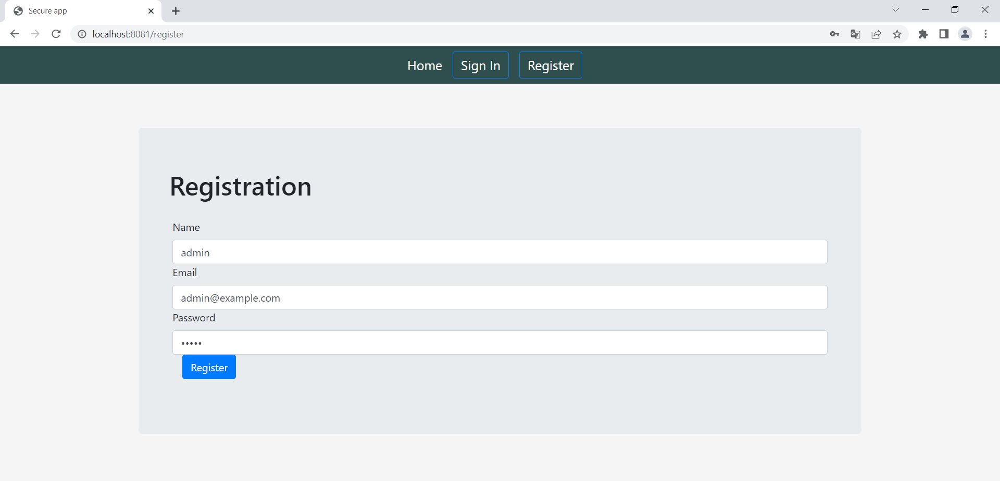
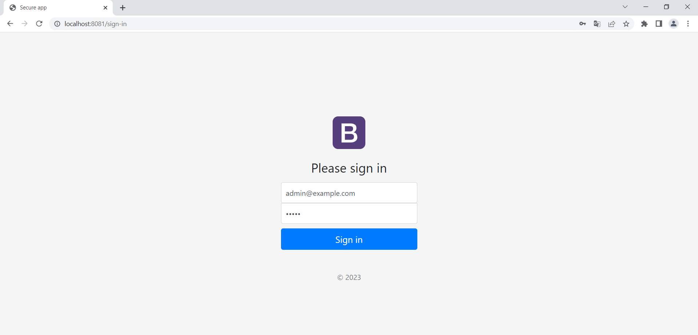
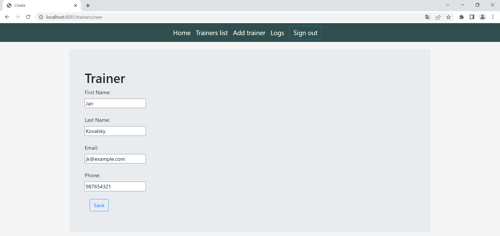
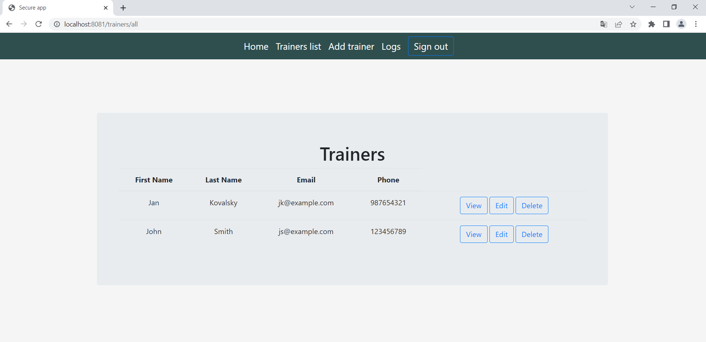
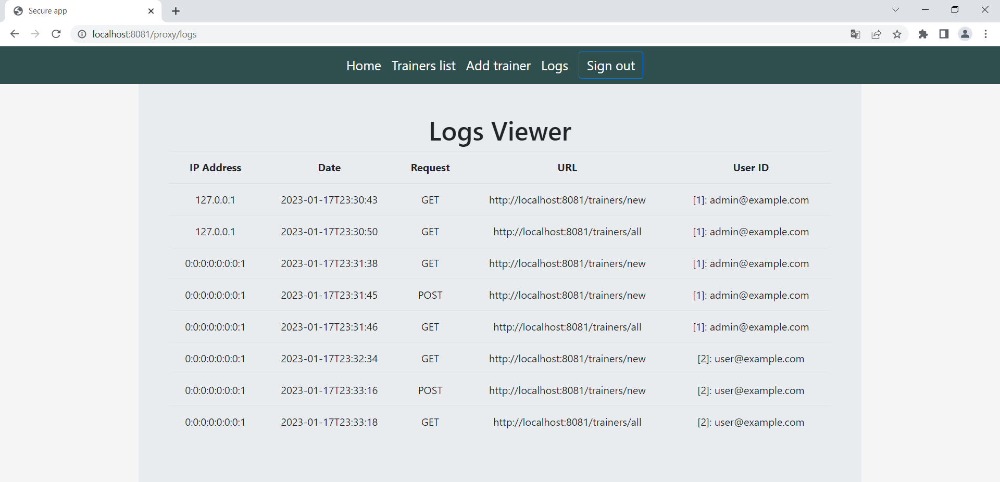

# rest-client-tracking-mainapp
Web-based application to manage the list of trainers and viewing logs.

### Run MySQL database
```bash
docker run -p 3306:3306 --name restclienttracking -e MYSQL_ROOT_PASSWORD=root -e MYSQL_DATABASE=restclienttracking --rm -d mysql
```

## How to use
1. Run rest-service-tracking:
```sh
https://github.com/DanielsTT/rest-service-tracking
```
rest-service-tracking saves and stores in its database logs about the actions that the user has performed in rest-client-tracking-mainapp


2. Run rest-client-tracking-mainapp


3. Navigate to:
```sh
http://localhost:8081
```


4. Create account:



5. Sign in:



6. Add new trainer:



7. List of added trainers:



8. Actions that the user performed while adding, editing, deleting and viewing list of trainers are stored in rest-service-tracking database. On Log Viewer page you can check individual actions and user data:
